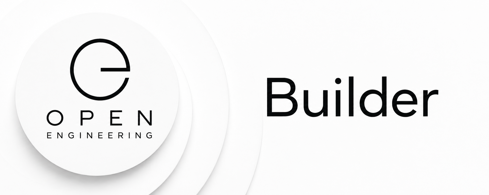

# Open Engineering Builder

<p align="center">
  
</p>
<p align="center">
  <strong>From engineering intent to engineered reality.</strong>
</p>

⸻

## Welcome

Open Engineering Builder is the home of the concrete Builder implementation within the Open Engineering ecosystem.

A Builder is an engineering actor that turns intent into change.

It receives structured engineering context, understands the environment in which it operates, determines what needs to be created or changed, performs the work through available capabilities, validates the result, and produces evidence of what happened.

In its simplest form:
```
Intent
  ↓
Context
  ↓
Builder
  ↓
Plan
  ↓
Actions
  ↓
Artifacts + Runtime Changes
  ↓
Validation
  ↓
Evidence
```
The Builder closes the gap between describing an engineered system and actually building it.

⸻

## Why Builder?

Open Engineering increasingly describes systems declaratively.

We define:

* elements;
* conventions;
* capabilities;
* compositions;
* plans;
* rules;
* parsers;
* capsules;
* runtimes;
* infrastructure;
* applications;
* Picos;
* universes.

But definitions alone do not produce working systems.

Something has to act.

That is the role of the Builder.

A Builder takes structured engineering intent and turns it into a concrete, inspectable result.
```
Definition → Builder → Implementation
```
The Builder therefore sits at an important boundary in Open Engineering:

between what should exist and what actually exists.

⸻

## Builder as an Engineering Actor

A Builder is more than a code generator.

It is an actor participating in an engineering system.

A Builder may:

1. inspect engineering intent;
2. discover relevant definitions and conventions;
3. gather context;
4. resolve dependencies;
5. construct a plan;
6. select capabilities and tools;
7. execute engineering actions;
8. inspect the resulting state;
9. validate that state against the intent;
10. record evidence;
11. report the outcome.

This produces a feedback loop rather than a one-shot generation step.
```
              ┌───────────────┐
              │    Intent     │
              └───────┬───────┘
                      │
                      ▼
              ┌───────────────┐
              │    Builder    │
              └───────┬───────┘
                      │
          ┌───────────┼───────────┐
          ▼           ▼           ▼
       Observe       Plan       Execute
          │           │           │
          └───────────┼───────────┘
                      ▼
                  Validate
                      │
                      ▼
                   Evidence
                      │
                      └───────────────┐
                                      │
                                      ▼
                                   Builder
```
The Builder can therefore observe the consequences of its work and continue until the desired engineering state has been reached.

⸻

## What Can a Builder Build?

Potential targets include:

### Source

* repositories;
* applications;
* services;
* libraries;
* rulesets;
* parsers;
* configuration;
* documentation.

### Infrastructure

* Kubernetes resources;
* Crossplane resources;
* compositions;
* environments;
* networking;
* identities;
* runtime dependencies.

### Open Engineering Elements

* Picos;
* capsules;
* runtimes;
* operating systems;
* capabilities;
* workflows;
* integrations.

### Engineering Artifacts

* schemas;
* manifests;
* diagrams;
* documentation;
* tests;
* evidence;
* reports.

The target is deliberately not restricted to software source code.

Building is an engineering operation.

⸻

## Builders and AI

Builders are designed for an engineering world in which humans and AI agents work together.

An AI model can reason about a task.

A tool can perform an operation.

A capability describes something that can be done.

A Builder connects these concepts into an engineering process.
```
Human / Agent
      │
      ▼
    Intent
      │
      ▼
   Builder
      │
      ├── Definitions
      ├── Conventions
      ├── Rules
      ├── Memories
      ├── Evidence
      └── Capabilities
              │
              ▼
           Tools
              │
              ▼
       Engineered State
```
The Builder does not need to contain every capability itself.

Instead, it should discover, compose, and invoke capabilities supplied by the surrounding Open Engineering ecosystem.

⸻

## Composition Over Reinvention

A core principle of Open Engineering is:

Composition over duplication.

The Builder follows that principle.

It should not independently redefine concepts already owned elsewhere in the ecosystem.

Instead, it consumes them.

For example:
```
Conventions ───────┐
Definitions ───────┤
Rules ─────────────┤
Parsers ───────────┤
Capabilities ──────┤
Memories ──────────┤
Plans ─────────────┼──▶ Builder ───▶ Result
Compositions ──────┤
Runtimes ──────────┤
Evidence ──────────┘
```
The Builder becomes a consumer and executor of shared engineering knowledge.

⸻

## Declarative Where Possible

The desired state should preferably be expressed declaratively.

Instead of:

Run these seventeen commands.

prefer:

This is the state that should exist.

The Builder determines how to move from the observed state toward that desired state.
```
Desired State
     +
Observed State
     │
     ▼
   Builder
     │
     ▼
Difference
     │
     ▼
Plan
     │
     ▼
Execution
     │
     ▼
New Observed State
```
This makes Builder behavior compatible with technologies and ideas such as:

* GitOps;
* Kubernetes;
* Crossplane;
* controllers;
* reconciliation;
* declarative APIs;
* agentic engineering.

⸻

## Reconciliation

An important long-term property of a Builder is reconciliation.

A Builder should eventually be able to answer:
```
What should exist?
        │
        ▼
What currently exists?
        │
        ▼
What is different?
        │
        ▼
What should I do?
        │
        ▼
Did it work?
```
This transforms building from a one-time activity into a controlled engineering lifecycle.
```
Observe
   ↓
Compare
   ↓
Plan
   ↓
Build
   ↓
Validate
   ↓
Observe
   ↺
```
⸻

## Evidence-Driven Engineering

A Builder should never merely claim:

Done.

It should be able to demonstrate why the work is considered complete.

Evidence might include:

* generated artifacts;
* Git commits;
* pull requests;
* build results;
* test results;
* validation reports;
* deployment status;
* Kubernetes state;
* runtime observations;
* screenshots;
* logs;
* telemetry;
* provenance records.

The desired lifecycle is:
```
Intent
   ↓
Change
   ↓
Observation
   ↓
Evidence
   ↓
Conclusion
```
This supports one of the fundamental Open Engineering principles:

Engineering claims should be backed by evidence.

⸻

## Builder Lifecycle

A generic Builder lifecycle can be represented as:
```
RECEIVE
   │
   ▼
UNDERSTAND
   │
   ▼
DISCOVER
   │
   ▼
PLAN
   │
   ▼
BUILD
   │
   ▼
OBSERVE
   │
   ▼
VALIDATE
   │
   ├──────── failure ────────┐
   │                         │
   ▼                         │
RECORD                       │
   │                         │
   ▼                         │
REPORT                       │
                             │
                             └──▶ REPLAN
```
Individual Builder implementations may specialize this lifecycle while preserving the common semantics.

⸻

## Builder Context

A Builder should operate with explicit context.

A possible conceptual context is:
```
builder:
  intent: ...
  target: ...
  environment: ...
  definitions: ...
  conventions: ...
  constraints: ...
  capabilities: ...
  dependencies: ...
  observations: ...
  memories: ...
  evidence: ...
```
The exact schema belongs in the appropriate Open Engineering definition and convention repositories.

The important principle is that Builder behavior should be inspectable rather than hidden inside prompts.

⸻

## Builder vs. Builders

The distinction between the singular and plural concepts is intentional.

### Builders

Open Engineering Builders describes the broader concept, contracts, patterns, taxonomy, and ecosystem of Builders.
```
Builders
   ↓
defines what a Builder can be
```

### Builder

Open Engineering Builder provides a concrete implementation.
```
Builder
   ↓
implements those concepts
```

Together:

```
Open Engineering Builders
        │
        │ definitions
        ▼
Open Engineering Builder
        │
        │ implementation
        ▼
     Execution
```

This follows the recurring Open Engineering pattern of separating definition from implementation.

⸻

## Relationship to Open Engineering

The Builder participates in the wider Open Engineering graph rather than becoming a new center of gravity.
```
                    Open Engineering
 Definitions ─┐
 Conventions ─┤
 Capabilities ┤
 Rules ───────┤
 Parsers ─────┤
 Memories ────┤
 Plans ───────┼────▶ Builder
 Evidence ────┤          │
 Capsules ────┤          ▼
 Compositions ┤       Execution
 Runtimes ────┤          │
 Elements ────┘          ▼
                       Reality
```
The Builder is therefore one participant in a composable engineering architecture.

⸻

## Design Principles

Open Engineering Builder should evolve according to several principles.

### Intent before implementation

Understand what needs to be achieved before deciding how to achieve it.

### Composition over duplication

Reuse existing Open Engineering definitions, capabilities, conventions, and services.

### Declarative over imperative

Describe desired state whenever practical and let the Builder determine the required actions.

### Evidence over assertion

Completion should be demonstrated through observable evidence.

### Idempotence where possible

Repeating a Builder operation should converge toward the same desired state rather than producing uncontrolled duplication.

### Explicit context

Important assumptions, dependencies, constraints, and decisions should be represented as data.

### Human inspectability

Plans and significant actions should remain understandable to engineers.

### Replaceable intelligence

The architecture should not depend unnecessarily on one AI model, agent framework, or provider.

### Open interfaces

Builders should interact with the ecosystem through documented contracts and interoperable interfaces.

### Safe execution

A Builder should understand the scope and consequences of the actions it is permitted to perform.

⸻

## A Simple Example

Suppose the desired engineering intent is:

Build a Hello World Pico and run it in Manifold.

The Builder should not simply generate arbitrary files.

It might instead discover:
```
Intent
  │
  ├── Pico definition
  ├── Pico conventions
  ├── Rule definitions
  ├── Ruleset implementation
  ├── Parser definitions
  ├── Runtime definition
  ├── Manifold environment
  └── Deployment capabilities
```
It can then derive a plan:

1. Validate the requested Pico
2. Resolve the required ruleset
3. Generate or assemble the Pico artifacts
4. Validate them against conventions
5. Prepare the runtime resources
6. Deploy to Manifold
7. Observe the Pico
8. Verify expected behavior
9. Capture evidence
10. Report the result

The important result is not merely generated source.

The result is:

A verified Pico running in the intended environment, with evidence that it works.

⸻

## Repository Direction

The implementation hosted by this organization should gradually establish:
```
source/
├── builder/
│   ├── context/
│   ├── discovery/
│   ├── planning/
│   ├── execution/
│   ├── observation/
│   ├── validation/
│   ├── evidence/
│   └── reporting/
│
├── capabilities/
├── adapters/
├── integrations/
├── schemas/
├── examples/
├── tests/
└── docs/
```
This is an architectural direction rather than a rigid initial structure.

The implementation should grow from small, demonstrable Builder loops instead of attempting to implement the entire vision at once.

⸻

## Minimum Viable Builder

A useful first milestone is deliberately small.
```
Intent
   ↓
Builder
   ↓
Plan
   ↓
Repository Change
   ↓
Validation
   ↓
Evidence
```
For example:

Given a structured request to create a minimal Open Engineering artifact, discover the relevant convention, create the artifact in a controlled workspace, validate it, and return both the artifact and evidence.

From there the Builder can progressively gain:
```
Repository Building
        ↓
Multi-Repository Building
        ↓
Infrastructure Building
        ↓
Runtime Building
        ↓
Composition Building
        ↓
Reconciliation
        ↓
Autonomous Engineering Loops
```
⸻

## The Goal

Open Engineering Builder is ultimately about making engineering intent executable.
```
Describe
   ↓
Understand
   ↓
Plan
   ↓
Build
   ↓
Observe
   ↓
Prove
   ↓
Improve
```
The ambition is not an AI that merely writes code.

It is an engineering actor capable of participating responsibly in the lifecycle of real systems.

⸻

<p align="center">
  <strong>Define openly. Compose intelligently. Build with evidence.</strong>
</p>
<p align="center">
  Open Engineering Builder
</p>
